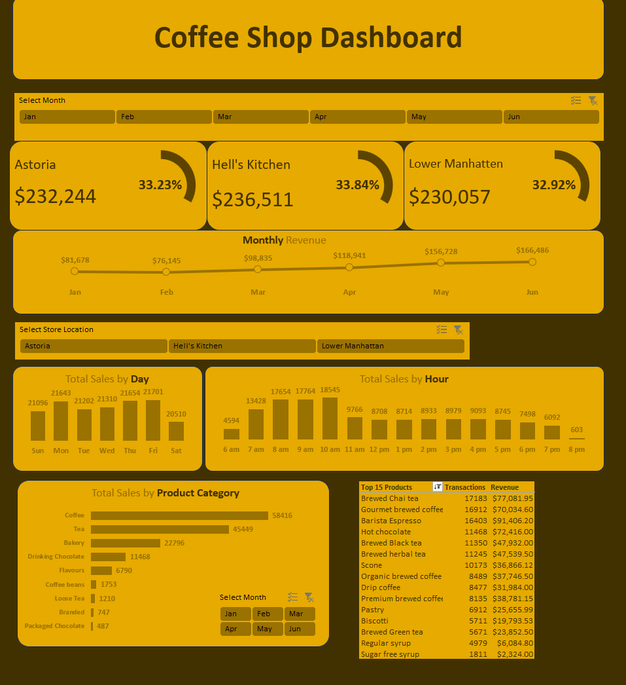

# DA-CoffeShop

### Project Overview
* Analyze the coffee shop transactional sales data from Jan-June 2023 in order to better understand purchase behavior and streamline operations
* Transform the data into an interactive and dynamic dashboard that franchise owners can use to identify patterns, trends, and opportunities for the business

---

### Dataset Used:
[Coffee-Shop-Sales](Data-Source/Coffee-Shop-Sales.xlsx) - Raw dataset in XLSX format

---

### Results/Findings
* The analysis results can be viewed [here](Results.md)

---

### Recommendations
* Shorten business hours
    * Hell's Kitchen: 8pm accounts for 1% of total sales
    * Lower Manhatten: 7pm accounts for 0.26% and 8pm accounts for 0.16% of total sales
* Staffing
    * Staffing schedule should match peak and slow business hours accordingly
* Customer Incentives
    * Promotions should be offered on low-performing products
    * Astoria should offer special day-specific promotions on their slowest days (Saturday and Tuesday) to increase sales
    * Hell's Kitchen should offer special day-specific promotions on their slowest day (Saturday) to increase sales
* Add Menu Item
    * Astoria needs to start selling Ouro Brasileiro shots because it sells well at the other two locations
    * Add more coffee and tea types as those are the best selling items across all 3 store locations
* Drop Menu Items
    * Astoria should consider dropping packaged chocolate, branded, and loose tea as they're the bottom 3 items and only account for 0.22%, 0.55%, and 0.68% of sales respectively
    * Hell's Kitchen should consider dropping branded and chocolate as they're the bottom 2 items and only account for 0.23% and 0.39% of sales respectively
    * Lower Manhatten should consider dropping packaged chocolate as it's the worst selling item and only accounts for 0.38% of sales
* Increase price on items that are in top 5 sales but not in top 5 revenue
    * Astorria: Earl Grey Rg, Spicy Eye Opener Chai Lg, Peppermint Rg, and Columbian Medium Roast Rg
    * Hell's Kitchen: Ouro Brasileiro shot, Morning Sunrise Chai Rg, Serenity Green Tea Rg, and Chocolate Croissant
    * Lower Manhatten: Chocolate Croissant, Peppermint Lg, Jamaican Coffee River Lg, and Columbian Medium Roast Rg

--- 

### Limitations
* Amount of data
    * Only Jan-June sales data were available which is a limited amount of data
    * It's worth looking into if we can get Jan-Dec sales data if there is any correlation between season and sales by type of product (I would imagine tea might sell better during the winter season but have no data to support this)

